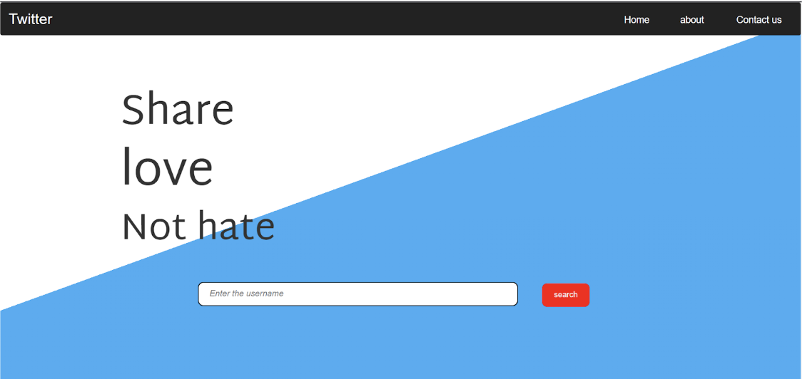
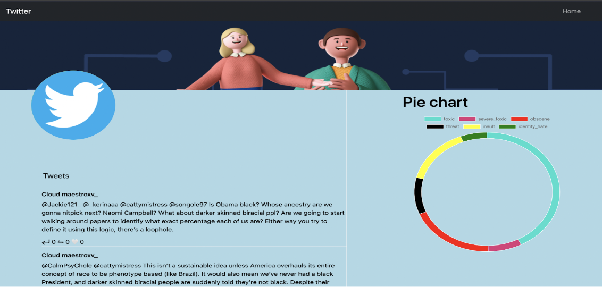

# twitter-account-analysis

This is a project to analyze the tweets of a twitter account. It uses BERT to classify the tweets into multiple categories. The categories are as below

collab link - `https://colab.research.google.com/drive/1GZP1qv84h6iPXi695NXg3dkraecfsmVn?usp=sharing`

## Dataset 

The types of toxicity are:

- toxic
- severe_toxic
- obscene
- threat
- insult
- identity_hate

Link - ``` https://www.kaggle.com/competitions/jigsaw-toxic-comment-classification-challenge ```

# Setup

## Model Used - BERT UNCASED 

Download and save the folder in backend/models/

Model link - ```https://drive.google.com/drive/folders/1--mapYkARlwpwYeu6oTxP7Ly2csH_AW5?usp=sharing ```

## Installation

```
pip install -r requirement.txt 
```
## Twint Installation

```
pip3 install --user --upgrade git+https://github.com/twintproject/twint.git@origin/master#egg=twint
```
## Backend - FLASK

```
cd backend
python main.py
```

---

1. Addd Twitter Username in the input field
   

2. Model will predict the tweets and display the result
   